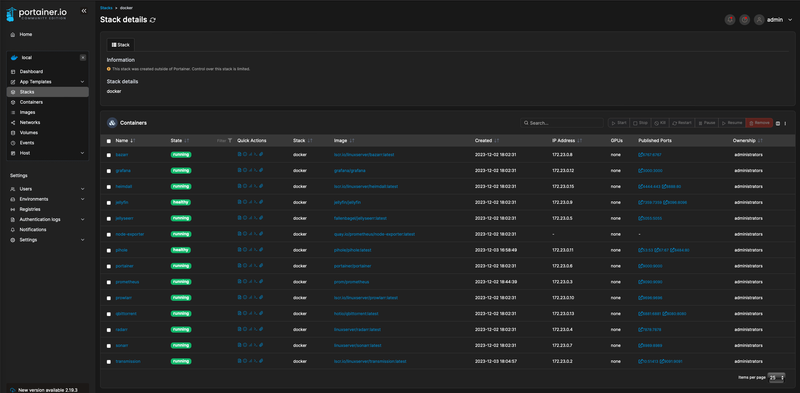

Steps to setup your own ubuntu server using docker compose to containerise many different applications with seamless maintenance achieving something like below.

## Ubuntu Server Install ##

1. Get a USB stick, install the latest LTS version of Ubuntu Server and then download balanaEtcher. Run balanaEtcher with what you just downloaded and turn your usb stick into a bootable drive.
2. Plug the USB stick into your server, turn on the server and follow the steps to setting up your server via the console. If you're failing to find drivers then shutdown the installation and re-run the computer to get into the BIOS settings. One common reason for a missing drive is RAID enabled so disable that if so.
3. You have now finished your installation of Ubuntu Server and you should be ready to start creating Docker containers and orchestrating them via docker compose.

## Directory Setup ##

Getting your directory setup correct from the beginning is super important to save time and to have an efficient media-server when it comes to your containers moving files.

### Docker configuration ###

All of your container's docker configuration files will live here. Please note that the config will be stored on your SSD if you follow below. You can change this to whatever you'd like.

`/docker/appdata`

For example, portainer's config will live here `/docker/appdata/portainer`

### Base Directory ### 

The base directory serves a purpose of allowing hard links between media and downloads.

`/mnt/media/media-server/data`

### Downloads Directory ###

Sonarr and Radarr will download the torrents here and use hard links to copy the files over to the `media directory`

`/mnt/media/media-server/data/downloads`

### Media Directory ###

This is where all of your media (tv and movies) will be stored. 

`/mnt/media/media-server/data/media`

Inside media you then have

`/mnt/media/media-server/data/media/tv`
`/mnt/media/media-server/data/media/movies`

### Complete Directory Look ###

Don't get confused by the complete and incomplete directories. These are added by Radarr and Sonarr.

You are free to change your directory setup but beware you will need to update the docker-compose.yml and .env to follow your changes.

## Mount Drive ##

`sudo mount -t exfat -o defaults,uid=1000,gid=1000 /dev/sda2 /mnt/media/media-server`

4. I have provided an example docker compose file with a .env file. By looking at the .env file you can see that the directory structure is like so:
## Directories ##
DOCKER_CONFIG_DIR=/docker/appdata
BASE_DIR=/mnt/media/media-server/data
DOWNLOAD_DIR=/mnt/media/media-server/data/downloads
MEDIA_DIR=/mnt/media/media-server/data/media
TV_DIR=/mnt/media/media-server/data/media/tv
MOVIES_DIR=/mnt/media/media-server/data/media/movies

7. Run the following command to run all of your containers together: "Docker Compose up -d"
